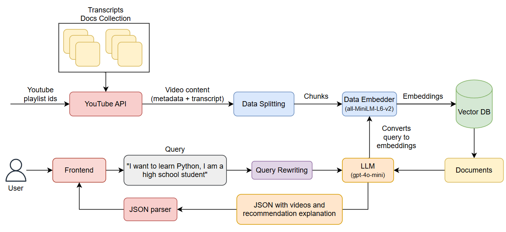

# Buscador de Videos Educativos

Sistema que devuelve videos relevantes para el usuario en función de su edad, conocimiento previo e intereses, implementando RAG. Los videos provienen únicamente de fuentes académicas y con buena reputación, lo que aumenta la confiabilidad del resultado.

El usuario ingresa información contextual y describe en lenguaje natural qué quiere aprender (por ejemplo: _“Quiero aprender cómo definir una clase en Python”_). Además del prompt principal, el sistema pide datos sobre el usuario para adaptar la complejidad del material recomendado.

Cada resultado incluye:
- Título, canal y metadatos relevantes (duración, URL, etc.).
- Fragmentos de la transcripción que justifican la recomendación.
- Una breve explicación automática de por qué ese video es adecuado para el usuario.

## Arquitectura del Sistema

- Frontend: Next.js
- Backend: FastAPI
- Base de datos vectorial: Chroma
- Modelo de lenguaje: OpenAI (gpt-4o-mini)

## Pipeline Implementado



La búsqueda se realiza sobre el contenido real del video: se extraen las transcripciones y metadatos de cada video, se segmentan en chunks y se indexan mediante embeddings en una base vectorial. La recuperación se hace por matching semántico con la consulta del usuario, lo que permite encontrar fragmentos y videos relevantes aunque no usen las mismas palabras exactas.

## Ejecucion

### Backend

Para instalar las dependencias necesarias
```bash
uv sync
```

Ejecutar API
```bash
uv run python -m api.api
```

### Frontend

Ejecutar los siguientes comandos en la carpeta `frontend`

Para instalar las dependencias necesarias 
```bash
yarn
```

Para correr el Frontend
```bash
yarn dev
```